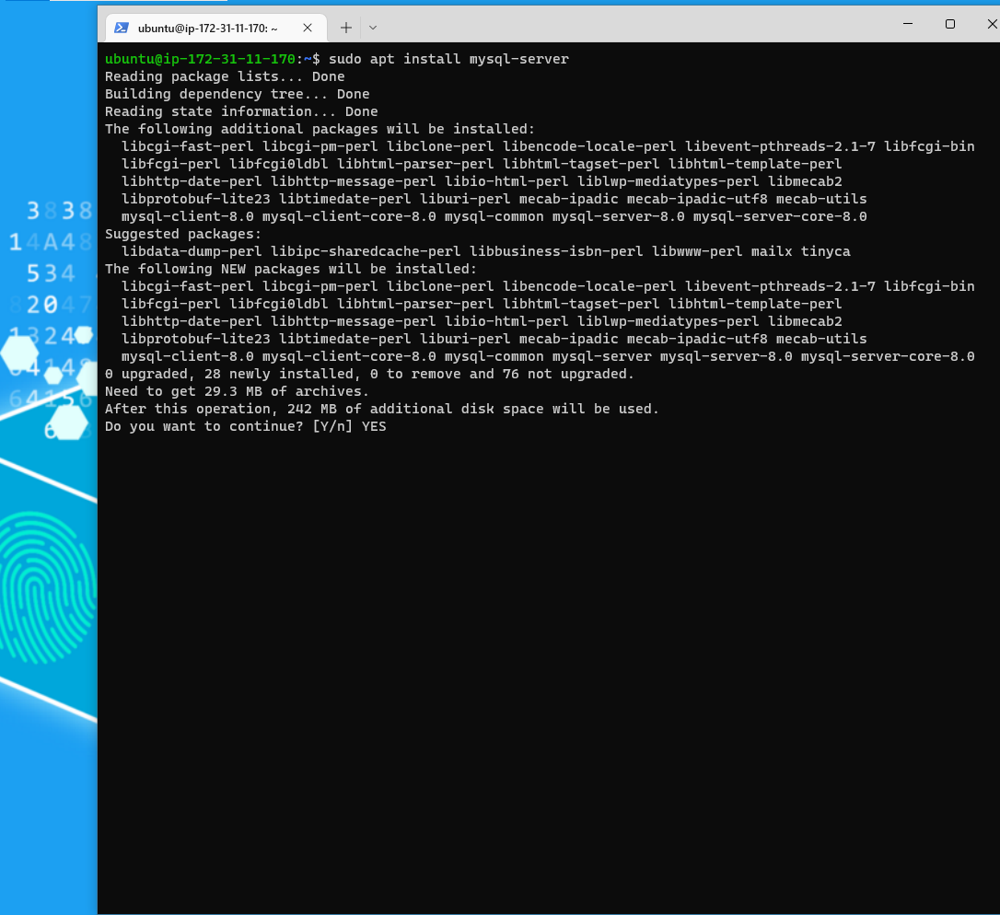
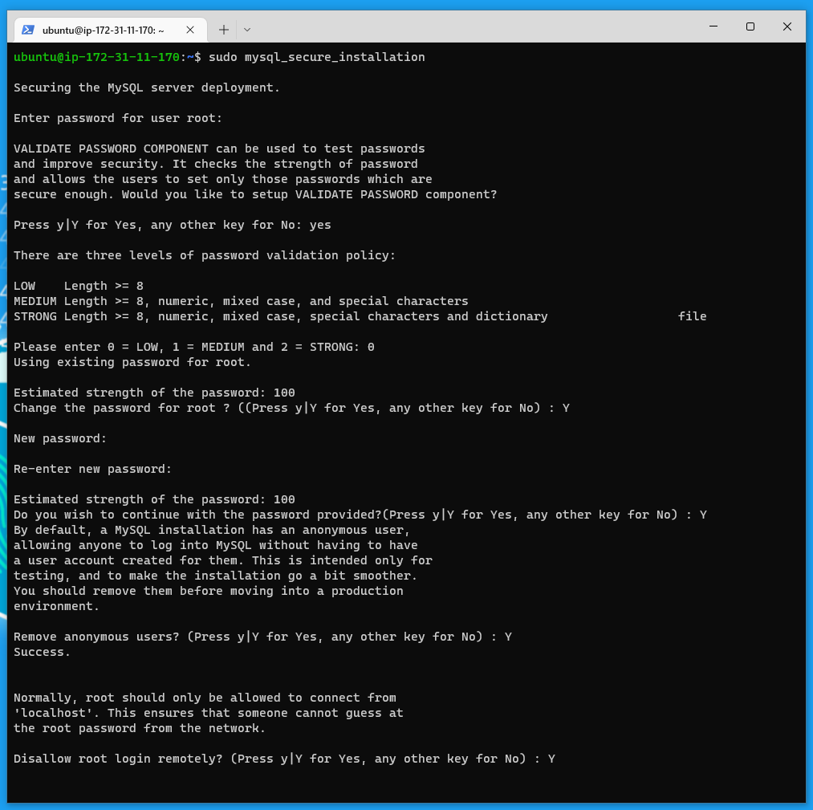
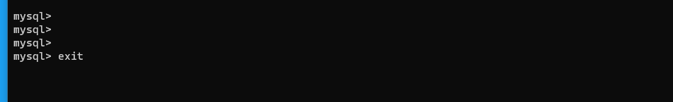

# STEP 1 - INSTALLING THE NGINX WEB SERVER
Running Server update before installing Nginx.

`sudo apt update`

`sudo apt install nginx`

Ubuntu Server Update

Nginx Installation

### To verify that nginx was successfully installed and is running as a service in Ubuntu, run

`sudo systemctl status nginx`

The webserver is up and running.

### Verifying that port 80 is opened on our EC2 Instance

### Our server is running and we can access it locally and over the Internet (Source 0.0.0.0/0 means ‘from any IP address’).

Accessing it locally in our Ubuntu shell, run:

`curl http://localhost:80`

or

`curl http://127.0.0.1:80`

These 2 commands above actually do pretty much the same – they use ‘curl’ command to request our Nginx on port 80 (actually you can even try without specify any port – it will work anyway). The difference is that: in the first case we try to access our server via DNS name and in the second one – by IP address (in this case IP address 127.0.0.1 corresponds to DNS name ‘localhost’ and the process of converting a DNS name to IP address is called "resolution"). 

### Testing to see how our Nginx server can respond to requests from the Internet.
Open a web browser   and try to access following url

http://18.169.104.12:80

# STEP 2 — INSTALLING MYSQL
AFter Installing our webserver ,we need to install a Database Management System(DBMS) to be able to store and manage data for the site in a relational database.

`sudo apt install mysql-server` 

Type YES and contiue installations

Log into the MYSQL console

`sudo mysql`

This will connect to the MySQL server as the administrative database user root, which is inferred by the use of sudo when running this command

## Securing our Database.
It’s recommended that  a security script that comes pre-installed with MySQL is run. This script will remove some insecure default settings and lock down access to the database system. Before running the script its recommended to set a password for the root user, using **mysql_native_password** as default authentication method. We’re defining this user’s password as PassWord.1.

`ALTER USER 'root'@'localhost' IDENTIFIED WITH mysql_native_password BY 'PassWord.1';`

### Start the interactive script by running

`sudo mysql_secure_installation`

Type yes on all the options

### After Securing our Database, checking to make sure the new password works

`sudo mysql -p`

# STEP 3 – INSTALLING PHP

We  have Nginx installed to serve our content and MySQL installed to store and manage our data. Now we can install PHP to process code and generate dynamic content for the web server.

While Apache embeds the PHP interpreter in each request, Nginx requires an external program to handle PHP processing and act as a bridge between the PHP interpreter itself and the web server. This allows for a better overall performance in most PHP-based websites, but it requires additional configuration. We’ll need to install php-fpm, which stands for “PHP fastCGI process manager”, and tell Nginx to pass PHP requests to this software for processing. Additionally, we’ll need php-mysql, a PHP module that allows PHP to communicate with MySQL-based databases. Core PHP packages will automatically be installed as dependencies.

To install these 2 packages at once, run:

`sudo apt install php-fpm php-mysql`

When prompted, type YES and press ENTER to confirm installation.

We now have our PHP components installed. Next, we will configure Nginx to use them.

# STEP 4 — CONFIGURING NGINX TO USE PHP PROCESSOR
we’ll create a directory structure within /var/www for the your_domain website, leaving /var/www/html in place as the default directory to be served if a client request does not match any other sites

`sudo mkdir /var/www/projectLEMP`

Next ,we assign ownership of the directory with the $USER environment variable, which will reference our current system user.

`sudo chown -R $USER:USER /var/www/projectLEMP`

We open new configuration file in Nginx's sites-available directory using your preferred command-line editor. nano is been used here.

`sudo nano /etc/nginx/sites-available/projectLEMP`

This will create a new blank file. Paste in the following bare-bones configuration:

Activating our configuration by linking to the config file from Nginx's sites-enabled directory:

`sudo ln -s /etc/nginx/sites-available/projectLEMP /etc/nginx/sites-enabled/`

This will tell Nginx to use the configuration next time it is reloaded. We can test our configuration for syntax errors by typing:

`sudo nginx -t`

We also need to disable default Nginx host that is currently configured to listen on port 80, for this run:

`sudo unlink /etc/nginx/sites-enabled/default`

Reload Nginx to apply the changes:

`sudo systemctl reload nginx`

Our new website is now active, but the web root /var/www/projectLEMP is still empty. Create an index.html file in that location so that we can test that our new server block works as expected:

`sudo echo 'Hello LEMP from hostname' $(curl -s http://169.254.169.254/latest/meta-data/public-hostname) 'with public IP' $(curl -s http://169.254.169.254/latest/meta-data/public-ipv4) > /var/www/projectLEMP/index.html`

Accessing the website URL using IP address via web browser:

http://18.169.104.12/:80

# STEP 5 – TESTING PHP WITH NGINX
Tesing to validate that Nginx can correctly handle .php files off to our PHP processor.

This can be done by creating a test PHP file in our document root. Open a new file called info.php within our document root in our text editor:

`sudo nano /var/www/projectLEMP/info.php`

Type or paste the following lines into the new file. This is valid PHP code that will return information about your server:

"<?php
   
   phpinfo();"

we can now access this page in our web browser by visiting the domain name or public IP address we’ve set up in our Nginx configuration file, followed by /info.php:

http://18.169.104.12/info.php

we will see a web page containing detailed information about our server:

After checking the relevant information about our PHP server through that page, it’s best to remove the file you created as it contains sensitive information about your PHP environment and your Ubuntu server. we can use rm to remove that file:

`sudo rm /var/www/projectLEMP/info.php`

# STEP 6 – RETRIEVING DATA FROM MYSQL DATABASE WITH PHP (CONTINUED)

We will create a test database (DB) with simple "To do list" and configure access to it, so the Nginx website would be able to query data from the DB and display it.

In order for us to be able to connect to the MySQL database from PHP we will need to create a new user with the mysql_native_password authentication method.

Firstly ,connect to the MySQL console using the root account:

`sudo mysql -p`

Enter the password then create a new database, run the following command from MySQL consloe:

`mysql> CREATE DATABASE 'project2_database';`

Now we can create a new user and grant the new user full privileges on the database we just created

The following command creates a new user named projec2_user, using mysql_native_password as defualt authentication method.We also set the user's password as d3v0ps@2022

` mysql> CREATE USER  'project2_user'@'% IDENTIFIED WITH mysql_native_password BY 'd3v0ps@2022';`

Now we need to give this user permission over the project2_database  database:

`mysql> GRANT ALL ON project2_database.* TO 'project2_user'@'%';`

This will give project2_user  user full privileges over the project2_database database, while preventing this user from creating or modifying other databases on the server.

Exit the MySQL Shell with :

`mysql> exit`

We need to check the user has the proper permission by logging in to the MySQL console again.

`mysql -u project2_user  -p `

Run the follwoing command

`SHOW DATABASE;`

Next, we’ll create a test table named todo_list. From the MySQL console, run the following statement:

`CREATE TABLE project2_database.todo_list (`
`mysql>     item_id INT AUTO_INCREMENT,`
`mysql>     content VARCHAR(255),`
`mysql>     PRIMARY KEY(item_id)`
`mysql> );`

Inserting a few rows of content in the project2 table.

`mysql > INSERT INTO project2_database.todo_list (content) VALUES ("My first Important item");`

Now we can create a PHP script that will connect to MySQL and query for our content. We can also Create a new PHP file in our custom web root directory using our preferred editor.

`nano /var/www/projectLEMP/todo_list.php`

http://18.169.104.12/todo_list.php

